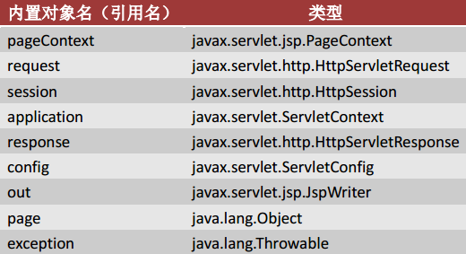

# JSP

## 1. syntax

-   `<% %>` just insert java code. Do not insert method, static or public, private, protected modifer.
-   `<%! %>` method, static or public, private, protected modifer can be insert into this tag.
-   `<%= %>` 该标签中的内容可以直接在JSP中输出变量、常量等，里面的内容是不用分号结尾的，会被JSP引擎直接翻译到_jspService方法中的out.write()方法中输出

```jsp
<%! private int a = 10; %>
<%! 
    public void m1(){
        System.out.println("m1方法");
    }
 %>

<!-- call m1 method -->
<% m1(); %> 
<% int a = 1024;%>
<%= a %>
<%= "monkey1024" %>
```

## 2. JSP inner object



-   `pageContext`: 页面上下文，通过该对象中的setAttribute和getAttribute方法设置访问范围只在当前页面中有效的数据，不过在当前页面范围中，数据都是可以直接使用的，所以该对象不常用
-   `out`: 该类型继承了IO流中的Writer，所以out是一个输出流对象，使用方法上跟PrintWriter类似。
-   `page`: 通过源码中可以看到，将this赋值给page，所以该对象就是servlet自己，在实际应用中不常使用
-   `exception`: 该对象通常配合page指令使用
-   `application`: 该对象和下面的对象的使用方法跟servlet中的一样
-   `request`
-   `response`
-   `session`
-   `config`

## 3. 指令

-   page指令: page指令用于设置当前JSP页面的相关信息， 一个 JSP中可以包含多个 page 指令

```jsp
<%@ page contentType="text/html" pageEncoding="UTF-8"  isErrorPage="true"%>
<%@ page import="java.util.*,java.sql.*" %>

<!-- define error page -->
<%@ page errorPage="/error.jsp" %> 

系统出现问题，请联系管理员

<%
    exception.printStackTrace(); // must set `isErrorPage` to true
%>
```

-   include指令: 包含指令，用于将某个文件包含到当前的 JSP 文件中。该指令只有一个属性 file，用于指定要包含的文件。
被包含的文件可以是 JSP 文件，也可以是 HTML文件。

```jsp
<%@ include file="/left.jsp" %>
<br>
<%= sum%>
```

## 4. tag

Only 2 most useful tag: `<jsp:forward>` and `<jsp:include>`

```jsp
<%
    request.setAttribute("name", "monkey1024");
%>

<jsp:forward page="/next.jsp"></jsp:forward>
```

```jsp
<%
    int sum = 100
%>
<br>
<jsp:include page="/left.jsp"/>
<br>
index sum=<%= sum %>
```

Note:

-   The difference for `<%@ include file="/left.jsp" %>` and `<jsp:include page="/left.jsp"/>`: The first one will only generate 1 java file, but the second will generate 2 java file. So **if you can use the first one, please use it.**

## 5. [EL expression](http://www.monkey1024.com/javaweb/952)

EL，Expression Language，表达式语言，是一种在JSP页面中获取数据的简单方式，通过${变量名}的方式可以获取到值，需要注意的是EL只能从 pageConext、request、session、application 四大域属性空间中获取数据。

```jsp
<% 
    pageContext.setAttribute("name", "page");
    request.setAttribute("name", "request");
    session.setAttribute("name", "session");
    application.setAttribute("name", "application");
%>
<!-- 使用域属性空间相关的内置对象获取数据 -->
${pageScope.name }
${requestScope.name }
${sessionScope.name }
${applicationScope.name }


<!-- object -->
<%     
    Student stu = new Student("张三", 22);
    School s = new School("小猴子",stu);
    request.setAttribute("s", s);
%>
<!-- 访问 school对象中的student对象中的属性 -->
${requestScope.s.stu.name }


<!-- list -->
<%     
    Student stu1 = new Student("张三", 22);
    Student stu2 = new Student("李四", 23);
    Student stu3 = new Student("王五", 24);
    List<Student> list = new ArrayList<Student>();
    list.add(stu1);
    list.add(stu2);
    list.add(stu3);
    request.setAttribute("list", list);
%>
<!-- 输出李四 -->
${list[1].name }
<!-- 没有输出也不会报错 -->
${list[50].name }


<!-- map -->
<%     
    Map<String,String> map = new HashMap<String,String>();
    map.put("name","monkey1024");
    map.put("password","123456");
    request.setAttribute("map", map);
%>
${map.name }
<br>
${map.password }


<!-- empty -->
<%     
    request.setAttribute("name", "");
    request.setAttribute("student", null);
    request.setAttribute("list", new ArrayList());
%>
<!-- 下面输出结果均为true -->
变量未定义：${empty no }<br>
空字符串：${empty name }<br>
对象是null：${empty student }<br>
集合中没有元素：${empty list }<br>


<!-- 内置对象pageContext -->
<form action="${pageContext.request.contextPath }/login.do"></form>
<!-- webxml initial param, you need to define context-param in web.xml -->
${initParam.admin} 
<!-- localhost:8080/07-04-jsp/index.jsp?hobby=basketball&hobby=football -->
${paramValues.hobby[0]}
${paramValues.hobby[1]}

```

Note:

-   EL 无法输出 Set 集合中的元素。因为 Set 集合中的元素是无序的，即没有索引的概念，所以无法通过索引获取元素。

