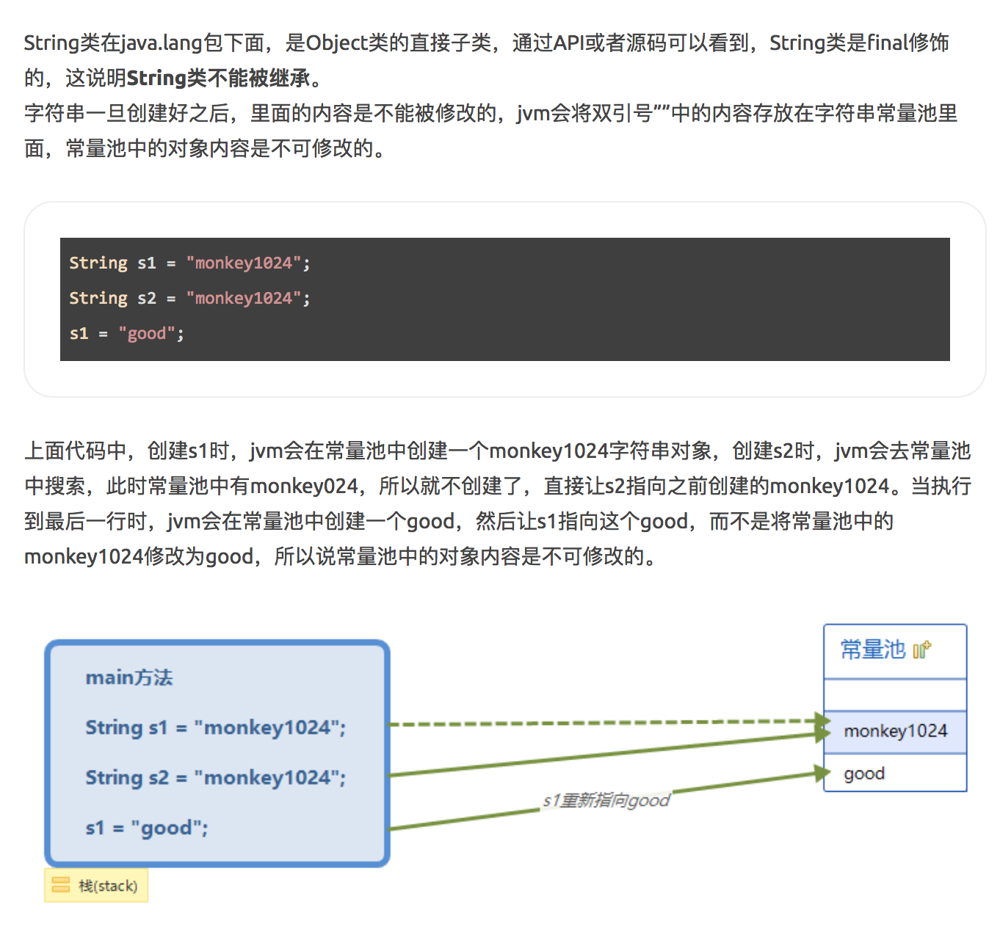

# String

## 1. notice

-   `String` is a `final` class. This means no class can extend String.

-   

-   If you are use `new` to create a String, then it will not only create a space in constant pool, will also open some space in heap.

```java
String s3 = new String("monkey");

String s4 = new String("monkey");

String s5 = "hello";

String s6 = "hello";

System.out.println(s3 == s4); // true
System.out.println(s3.equals(s4)); // true
System.out.println(s5== s6); // false
System.out.println(s5.equals(s6)); // true
```

-   String拼接会创建新的String, 所以会开辟新的内存空间. 因此不建议频繁拼接String. Please use `StringBuffer` or `StringBuilder`

## 2. some method

1. `char charAt(int index);`获取index位置的字符
2. `boolean contains(CharSequence s);`判断字符串中是否包含某个字符串
3. `boolean endsWith(String endStr);`判断是否是以某个字符串结尾
4. `boolean equalsIgnoreCase(String anotherString);`忽略大小写比较两个字符串是否相等
5. `byte[] getBytes();`转换成byte数组
6. `int indexOf(String str);`取得指定字符在字符串的位置
7. `int indexOf(String str, int fromIndex);`从指定的下标开始取得指定字符在字符串的位置
8. `int lastIndexOf(String str);`从后面开始取得指定字符在字符串最后出现的的位置
9. `int lastIndexOf(String str, int fromIndex);`从后面开始指定的下标开始取得指定字符在字符串的位置
10. `int length();`获取字符串的长度
11. `String replaceAll(String s1,String s2);`替换字符串中的内容
12. `String[] split(String s);`根据指定的表达式拆分字符串
13. `boolean startsWith(String s);`判断是否是以某个字符串开始
14. `String substring(int begin);`根据传入的索引位置截子串
15. `String substring(int beginIndex, int endIndex);`根据传入的起始和结束位置截子串
16. `char[] toCharArray();`将字符串转换为char数组
17. `void toUpperCase();`转换为大写
18. `void toLowerCase();`转换为小写
19. `String trim();`去除首尾空格
20. `String valueOf(Object obj);`将其他类型转换为字符串类型