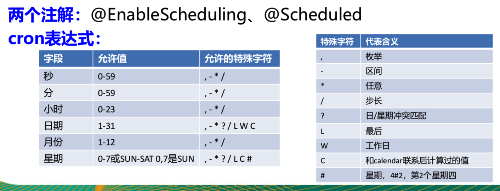

# Cron task in springboot

## 1. cron task

we have `@EnableScheduling` and `@Scheduled` annotation.

```java
@EnableScheduling
@SpringBootApplication
public class TaskApplication {
    public static void main(String[] args) {
        SpringApplication.run(TaskApplication.class, args);
    }
}
```

```java
@Service
public class TaskService {
    @Scheduled(cron = "0-4 * * * * MON-SAT")
    public void cronTask() {
        System.out.println("cron job start...");
    }
}
```

Note:

-  the cron format: `second, minute, hour, day of month, month, day of week`
    
    example:
    -   `0 * * * * MON-SAT`: Mon to Sat every minutes to run.
    -   `0,1,2,3,4 * * * * MON-SAT`: Mon to Sat each minutes with 0 to 4 second to run.
    -   `0-4 * * * * MON-SAT`: same as before.
    -   `0/4 * * * * MON-SAT`: every 4 second to run on Mon to Sat.
    -   `0 0/5 14,18 * * ?`: each day 14 o'clock and 18 o'clock, run every 5 minutes.
    -   `0 15 10 ? * 1-6`: 每个月的周一到周六10:15执行一次
    -   `0 0 2 ? * 6L`: 每个月的最后一个周六两点运行一次
    -   `0 0 2-4 ? * 2#1` 每个月的第一个周二两点到四点执行一次

-   